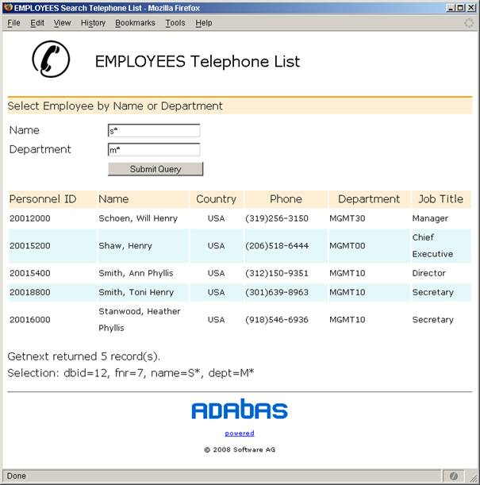

*******
Scripts
*******

There are some scripts in adapya-era that can be run on the command line.
They accept Unix style parameters. A help page is shown with the help option.

outq.py - Replicator output queue reader
========================================

outq.py listens to the Reptor output queue via EntireX Broker ACI and prints each Reptor
message according to its interpreted URB\* blocks.

The program is terminated by CTRL-C or when some program exception
occurs.
::

 Usage: python [-O] outq.py [options]

 -O run optimzied, debug code not generated do not display interpreded URB\*

 Options:
 -h, --help display this help

 -b, --broker .. id of broker ETBxxxxx or hostname:port

 -c, --class .. server class

 -n, --name .. server name

 -s, --service .. service (Reptor output queue)

 -u, --userid .. user id to be used

 -t, --trace .. sum of trace flags

 1 - dump buffers before Broker call

 2 - after call

 4 - print broker calls

 8 - detailed print of URB buffers

 Example:
 python outq.py -b ETB50019 -u MM -s MMSERV

inq.py - Replicator input queue writer
======================================

inq.py sends messages to the Replicator input queue via EntireX Broker ACI
and terminates.

The following input requests are defined:

- Status
- Initial-state-request
- Prior-transaction request

::

 Usage: python inq.py [options]

 Options:

 -h, --help display this help
 -b, --brokerid .. id of broker ETBxxxxx or hostname:port
 -c, --class .. server class
 -n, --name .. server name
 -s, --service .. service (Reptor input queue)
 -u, --userid .. user id to be used
 -k, --token token
 -r, --rnam .. response destination name
 -e, --arc .. architecture of input URB\* and of data

 is the integer of the sum of
 0/1 - high/low order byte first
 0/2 - ASCII/EBCDIC
 0/4/8 - IBM390/VAX/IEEE floating point

 -t, --trace .. sum of trace flags
 1 - dump buffers before Broker call
 2 - after call
 4 - print broker calls

 for type subscription status (STAT)
 -p, --snam .. subscription
 -d, --dnam .. destination

 for type Prior transaction request (TRAN)
 -p, --snam .. subscription
 -d, --dnam .. destination
 -q, --tseq .. transaction sequence number

 for type Initial-state request (INST)
 -a --dbid .. database id
 -f --fnr .. file number or fnr_list (see below)
 -i --inam .. initial-state name
 -l --isnl .. ISN or isn_list (see below)
 -v --value value_string for selection criteria
 -g --acode .. encoding of alpha values in value_string
 -w --wcode .. encoding of wide values in value_string

 An encoding is specified as cpX with

 X = ECS code page number, e.g. cp37 for US EBCIDIC code page 37,
     or as a name defined in ecscodec.py, e.g. utf8 for ECS code
     page 4091)

 fnr_list list of files for which initial state is to be requested

 e.g. (1,2,3,4) requests it for files 1-4

 no space can be within the parenthesises otherwise it must be
 surrounded by double quotes

 isn_list list of ISNs or ISN ranges surrounded by parenthesis. e.g.

   (1,2,3,4,10-1000,2001-2999,9999)

 No spaces allowed unless list enclosed in double quotes

 value_string value string matching the selection criterion defined
 in the INIITALSTATE parameters. A sequence of values can be
 specified by enclosing the comma separated values with parenthesis.
 No spaces allowed unless enclosed in double quotes. In addition a
 sequence element may be also:

   x'hexvalue' for a hexadecimal value
   e'string' for a string to be converted to EBCDIC

Examples::

 python inq.py -b ETB50019 -u MM -c REPTOR -n MMSERV -s IN1 -d OUT1

 python inq.py -b ETB50019 --userid MM --class REPTOR --name MMSERV --service IN1 -dnam OUT1

 python inq.py -b ETB50019 --userid MM --class REPTOR --name MMSERV --service IN1 --rnam OUT1 --token TOKTOK
    --inam ICOLOR --dbid 12345 --fnr (1,2)
                                     ----- = file\_list

 python inq.py ... --isnl (1,2,3,11-20,25)     requests initial state for ISNs 1,2,3 11 thru 20 and 25

 python inq.py ... --value (GR001,x'89AB',e'"ABC "') or alternatively "(GR001,x'89AB',e'ABC ')"

    with value being composed of 'GR001',x'89AB',x'C1C2C340'

 python inq.py ... --value "A B " --arc 9 --acode cp1252 --wcode utf8

readris.py - processor for sequential Replicator output
=======================================================

Read and process sequential replication output records as
produced by ADARIS or ADARPE.

Processing can be

- prepare the data as input for ADACMP and ADAMUP (-w / --write)
- apply the data to an Adabas target database (-a / -- ada)

If the dataset is located on z/OS use the -d otherwise the
-f parameter to specify a local file.

The remote dataset is a variable blocked sequential dataset.
It is fetched per FTP-get from z/OS as binary with RDW record prefix.

When the -w/--write <file prefix> parameter is specified

- the records are written to <file prefix>cmpin.d<dbid>f<fnr>
- the related ISNs are stored to <file prefix>mupisn.d<dbid>f<fnr>

With the -a/--ada <target config file> the configuration for applying
the replication data to an Adabas target database.

::

    Usage: readris [options]

    Options:
        -a  --ada           Adabas database target configuration
                            (e.g tapa2config for tapa12config.py)
        -d  --dsn           remote sequential dataset name
        -f  --fname         local file name
        -n, --numrec        <numrec> number of records to process
        -s, --skiprec       <skiprec> number of records skip before processing

        -v, --verbose       [0]|1|2|4|8|16|32
        -w  --write         file prefix
                            FTP parameters:
        -c, --config        set/show configuration
        -h, --host          <host name> of IBM FTP server         (*)
        -p, --pwd           <password>  FTP ser1.0.1ogin password (*)
        -u, --user          <userid>                              (*)

        -t  --test          <name> testing LNKUEX <name> DLL/SO
                            instead of adalnkx call the exit is called directly
        -?, --help

    defaults marked with (*) are taken from configuration (-c)
    The configuration values are stored ciphered in file ~/.toolz

    verbose 1/2 - FTP, 4 - dump records (exclusive RDW), 8 - display URB fields
            16 - dump CB, 32 - dump FB and RB

    if executed in Python optimized mode no URB short form will be printed
        (python -o readris.py ...)

    Examples:

    1. set configuration user, password

       >> readris --config --user hugo --pwd secret

    2. read remote ADARIS output dataset with verbose FTP operations; user and password
       are taken from configuration; creates the output files
       rpe2.cmpin.d10006f024 and rpe2.mupisn.d10006f024

       >> readris -d mm.temp.ris1 -h da3f -v8 -w rpe2.

    3. read local file with ADARIS or ADARPE data and store in Adabas database
       target db/fnr and subscription info is in tapa12config.py

       >> readris -f mm.temp.rpeapemu -a tapa12config

Demo application Employee Telephone List
========================================

The demo application processes the replication for the Adabas example
file EMPLOYEE.

In the Reptor definitions the format EMPLTEL defines a subset of the
original EMPLOYEE fields. This shows how to reduce overhead in only
replicating required information or how to hide sensitive information.

Reptor Parameters
-----------------
::

 ADARPD SUBSCRIPTION NAME=EMPLOYEE
 ADARPD   SACODE=819,SWCODE=4091,SARC=9
 ADARPD   SDESTINATION='OUT1'
 ADARPD   SFILE=11,SFDBID=10006
 ADARPD   SGFORMATAI=EMPLTEL

 ADARPD GFORMAT NAME=EMPLTEL Fields extracted for Telephone List Webapp
 ADARPD GFB='AA,AC,AD,AE,' PERSONNEL-ID FIRST-NAME MIDDLE LAST-NAME
 ADARPD GFB='AH,8,U,AL,' BIRTH COUNTRY
 ADARPD GFB='AN,AM,AO,AP.' AREA-CODE PHONE DEPT JOB-TITLE

Configuration
-------------

The following lines configure the client program - see out1Config.py:
::

 # define the mapping of data in record buffer to attributes
 # of EmpTel class

 empTelFormat='AA,AC,AD,AE,AH,8,U,AL,AN,AM,AO,AP.'

 # create datamap object for Employees-Telephone-List

 emp=Datamap('EmplTel',
     String('personnel_id', 8),
     String('firstname', 20),
     String('m_initial', 20),
     String('lastname', 20),
     String('birth', 8),
     String('country', 3),
     String('areacode', 6),
     String('phone', 15),
     String('department', 6),
     String('jobtitle', 25)
     )

 # define formats and mapping for each file specified in subscription
 psf=ParmsSfile(sdbid=10006,sfnr=9,tdbid=12,tfnr=7,
                fb=empTelFormat,dmap=emp)

 # define subscription with all its sfiles defined
 psu=ParmsSubscription(subscription='EMPLOYEE',sversion='01',sfiles=[psf])

 # define Reptor Broker parameters
 pbs=ParmsBrokerService(
     broker_id='ETB50019',
     server_class='REPTOR',
     server_name='MMSERV',
     service='OUT1',
     user_id='UEmplTel')

Intial-State Request for Selected Records
-----------------------------------------

The following requests Initial-state for the EMPLOYEE file selecting
records 20002000 through 20003999::

 >python inq.py --inam IEMPLAA --dbid 10006 --fnr 9
                --value 2000200020003999
                --acode cp819 --wcode utf8 --arc 9
                --rnam OUT2 --token TOKTOTOK

Trace of Client Processing a Record
-----------------------------------
::

 >python rcOut1.py

 URBR -- initial state record fnr 9 isn 828

 URBD(1) after image
 0000 32303030 32393030 544F4D20 20202020 20002900TOM
 0010 20202020 20202020 20202020 20202020
 1 identical line(s) suppressed
 0030 44494C57 4F525448 20202020 20202020 DILWORTH
 0050 31303120 20283231 39293436 342D3234 101 (219)464-2
 0060 32312020 4D474D54 31305345 43524554 21 MGMT10SECRE
 0070 41525920 20202020 20202020 20202020 ARY
 0080 202020

 Enter URBD handler: R A, isn 828
 cmd=E1 op1/2= / dbid=12 fnr=7 rsp=113
 cid= isn=828 isl=0 isq=0

 Note: Before Image not found ISN 828

 cmd=N2 op1/2= / dbid=12 fnr=7 rsp=0
 cid= isn=828 isl=0 isq=0

 Exit URBD handler: R A, isn 828/828, num recs 18

 URBE -- end of transaction 0 for subscription EMPLOYEE

 Enter URBE handler: EMPLOYEE tsnr 0, in TA 1, cnt 9
 End Transaction 0 for subscription EMPLOYEE with 9 updates

 cmd=ET op1/2= / dbid=12 fnr=7 rsp=0
 cid= isn=828 isl=0 isq=0

 Exit URBE handler: EMPLOYEE, tsnr 0, in TA 0, cnt 9

Reading the Replicated File on the Target Database
--------------------------------------------------
::

 >python EmpltelReadIsn.py

 Read by ISN on Employees-Telephonelist file 7 on database 12
 starting from ISN 0 for 1100 records

 820 20002100 Forrest, Mona D. USA 0101 (312)824-9206 SALE40 0028-09-23 Secretary [#]_
 821 20002200 Dekker, Sylvia Jennifer USA 0101 (213)183-1707 TECH10 0026-03-05 Dba
 822 20002300 Smith, Elsa R. USA 0101 (213)793-6785 TECH10 0027-09-02 Programmer
 823 20002400 Ferrari, Shirly Phyllis USA 0101 (415)822-9155 SALE20 0034-12-31 Sales Person
 824 20002500 Alexander, Holly P. USA 0101 (608)793-6137 SALE20 0046-01-02 Sales Person
 825 20002600 Mcdonald, Rosa Jennifer USA 0101 (316)409-2438 SALE20 0056-07-16 Sales Person
 826 20002700 Romerio, Virginia S. USA 0101 (301)738-5508 MGMT30 0045-04-06 Manager
 827 20002800 Davenport, Ann Phyllis USA 0101 (415)538-7860 TECH10 0048-12-25 Analyst
 828 20002900 Dilworth, Tom USA 0101 (219)464-2421 MGMT10 0040-02-24 Secretary
 Sequential Read by ISN returned 9 record(s).

.. footnote [#] The full name and position are stored upper-case in the database
   and capitalized for display.

Web Application "Employee Telephone List"
-----------------------------------------

The "Employee Telephone List" web application is implemented by the
function select() in module emplist.py
It is executed as publishing handler under the open source Apache web
server using the mod\_python extension. Components:

The Apache configuration file "hppt.conf" needs the following additional
lines::

 LoadModule python\_module modules/mod\_python.so
 Alias /apps "C:/ADA/WEB/apps"
 # emplist.py must be copied here as well as images/ subdirectory
 <Directory "C:/ADA/WEB/apps">
 Options Indexes MultiViews
 AllowOverride All
 Order allow,deny
 Allow from all
 AddHandler mod\_python .py
 PythonHandler mod\_python.publisher
 PythonDebug On
 PythonPath "sys.path+['c:/ADA/python/dev']"
 SetEnv HTMLDIR "C:/ADA/WEB/apps"
 </Directory>

To browse the telephone list enter the URL e.g.

`http://localhost/apps/emplist.py/select <http://localhost/apps/emplist.py/select>`_

To select with search criteria on name or department enter the URL e.g.

`http://localhost/apps/emplist.py/select?name=S\*;dept=M\* <http://localhost/apps/emplist.py/select?name=S*;dept=M*>`_

